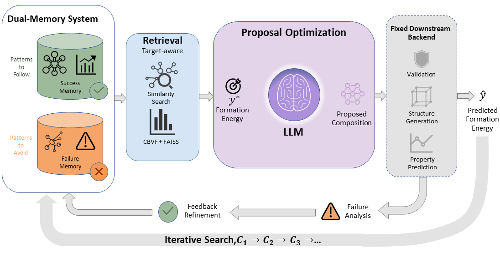

# Failure-Aware Dual-Memory

An LLM-driven inorganic materials composition search framework. Given a target property value (e.g., formation energy), the system iteratively proposes candidate chemical compositions, generates their crystal structures via a diffusion model, evaluates predicted properties, and refines the next proposal using a **dual-memory** mechanism that separately tracks past successes and failures.



## How It Works

1. **Propose** — an LLM proposes a candidate chemical composition.
2. **Validate** — composition validity is checked (pymatgen + SMACT).
3. **Generate** — a diffusion model (DiffCSP) generates candidate crystal structures for the composition.
4. **Evaluate** — a pretrained GNN (ComFormer) predicts the target property for each structure.
5. **Feedback** — the best prediction is converted into natural-language feedback.
6. **Retrieve & Propose** — both successful and failed past attempts are retrieved from dual FAISS memory stores and injected into the LLM prompt to guide the next proposal.
7. Repeat until the predicted value is within the success threshold, or the iteration budget is exhausted.

## Repository Structure

```
failure_aware_dual_memory/   # Core package: proposer, evaluator, memory, validator
scripts/
  run_pipeline.py            # Main CLI entry point
  pipeline_workflow.py       # Full pipeline implementation
  initialize_memory_from_mp20.py  # Build FAISS memory store from MP-20 dataset
  merge_memory_stores.py     # Merge multiple memory stores into one
  build_memory_subset.py     # Filtered/stratified memory subset builder
  test_memory_system.py      # Smoke test for memory components
  calc_vun_metrics.py        # Validity / Uniqueness / Novelty evaluation
  setup_environment.sh       # One-command conda/uv environment setup
run_failure_aware_dual_memory.sh  # Shell wrapper for convenience
data/                        # Dataset assets (MP-20, MP-60)
```

## Quick Start

### 1. Install

```bash
bash scripts/setup_environment.sh
```

This creates a conda environment with all dependencies (PyTorch, PyG, transformers, pymatgen, FAISS, etc.) and installs the package in editable mode.

### 2. Initialize memory

```bash
python scripts/initialize_memory_from_mp20.py \
  --mp20_test_path "./data/mp_20/test.csv" \
  --memory_storage_dir "./memory_storage_mp20_init"
```

### 3. Run the pipeline

```bash
python scripts/run_pipeline.py \
  --llm_model "/path/to/local-llm" \
  --data_path "./data/mp_20/train.csv" \
  --memory_storage_dir "./memory_storage_mp20_init" \
  --output_dir "./test_outputs/example_run" \
  --target_value -3.8 \
  --n_init 1 \
  --n_iterations 8
```

Or use a Hugging Face model:

```bash
export FADM_LLM_MODEL="Qwen/Qwen2.5-1.5B-Instruct"
bash ./run_failure_aware_dual_memory.sh
```

### Key arguments

| Argument | Description |
|---|---|
| `--llm_model` | Local model path or Hugging Face ID |
| `--target_value` | Target formation energy (eV/atom) |
| `--n_init` | Number of independent runs |
| `--n_iterations` | Max iterations per run |
| `--success_threshold` | Early-stop threshold (default: 0.25 eV/atom) |
| `--freeze_memory` | Retrieval-only mode (no new entries written) |
| `--k_success` / `--k_failure` | Number of retrieved examples per memory branch |


## Acknowledgement

This project builds on [CDVAE](https://github.com/txie-93/cdvae), [DiffCSP](https://github.com/jiaor17/DiffCSP), [ComFormer](https://github.com/divelab/AIRS/tree/main/OpenMat/ComFormer), and [MatExpert](https://github.com/BangLab-UdeM-Mila/MatExpert).
